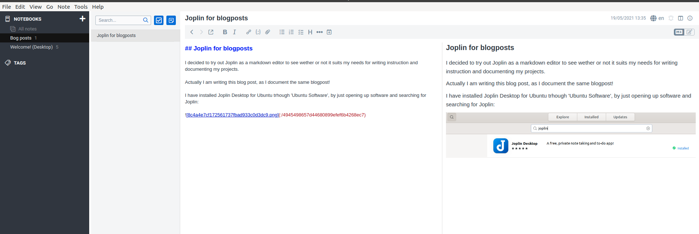

Joplin for blogposts

## Joplin for blogposts

I decided to try out Joplin as a markdown editor to see wether or not it suits my needs for writing instruction and documenting my projects.

Actually I am writing this blog post, as I document the same blogpost!

I have installed Joplin Desktop for Ubuntu trhough **'Ubuntu Software'**, by just opening up software and searching for Joplin:

There are 4 column of Joplin.

**Notebooks** 	| 	**Notes** 	| 	**Editor**		| **Visual representation**

Now it will be exciting to see how I can bring in the pictures for my posts :)

Apparantly Jekyll ignores files that starts with underscore.

**Meaning the following files:**

But at last I found a way to include pictures on my blogposts :)
